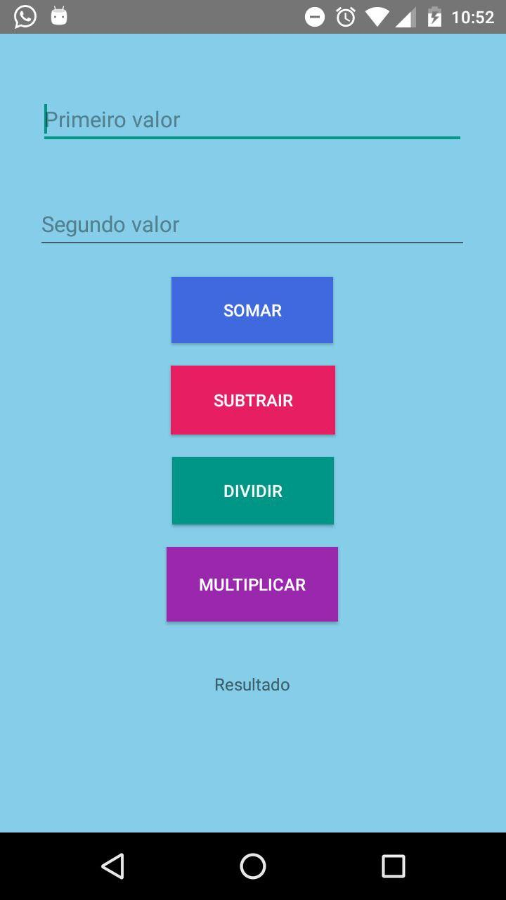

# Calculadora Simples em Android
Este é um projeto feito em Android, de uma calculadora simples que realiza 4 operações matemáticas, feito com atividade da matéria de Programação de Aplicativos Mobile da ETEC Guaianazes do curso de Desenvolvimento de Sistemas 

## Desenvolvedores: 
    - Miguel Riquelme
    - Tabata Fernanda

## Ilustração

